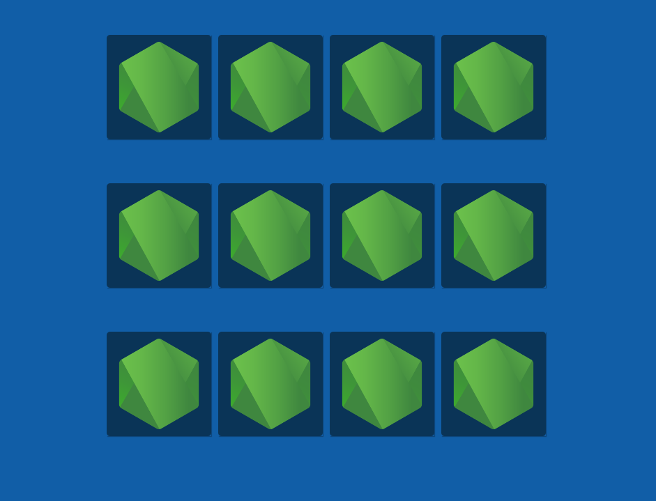
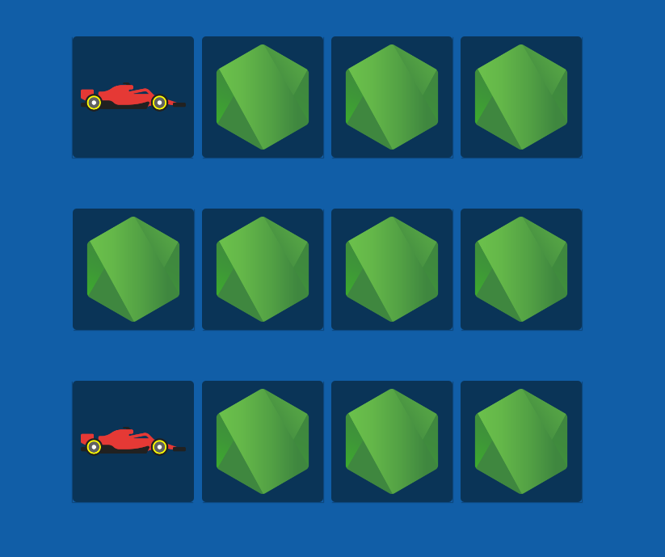
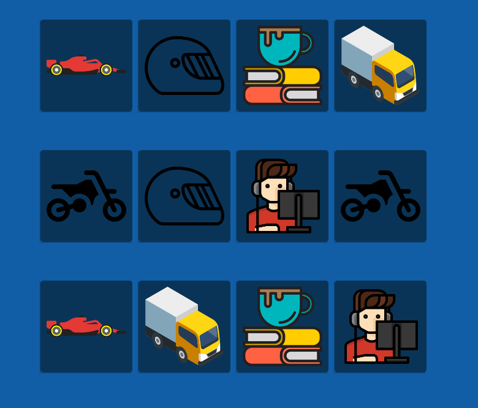

<h1 align="center">:books: Jogo da memória</h1>

## :memo: Descrição
Jogo da memória básico, criado com funções JavaScript e funções de CSS

## :wrench: Tecnologias utilizadas
* JavaScript;
* CSS3;
* HTML5;

## :rocket: O jogo
* Página inicial

* Tela inicial

* Cartas viradas

* Concluído

