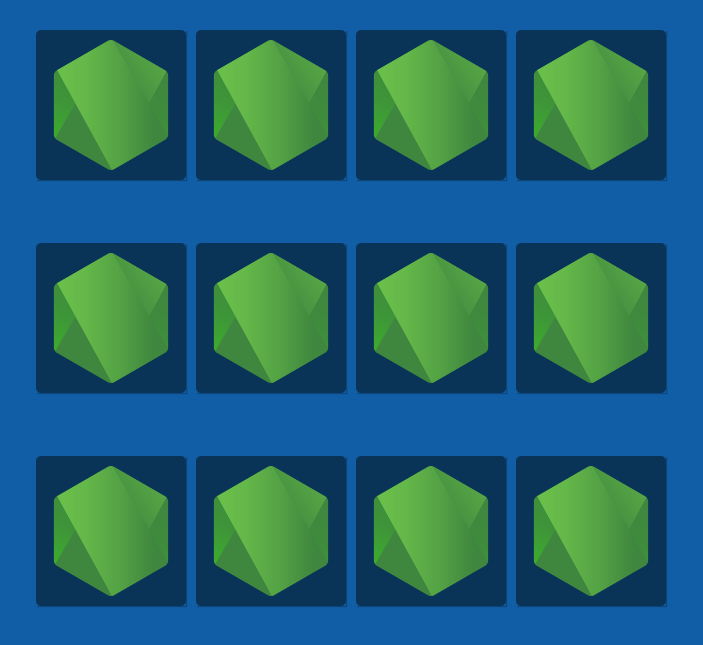
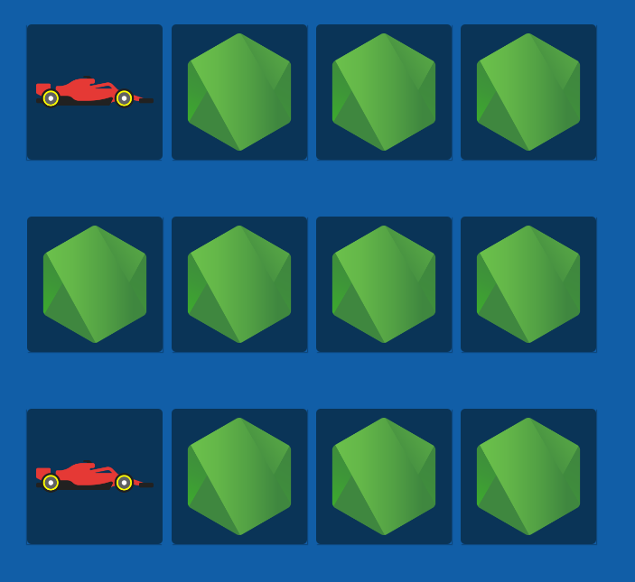
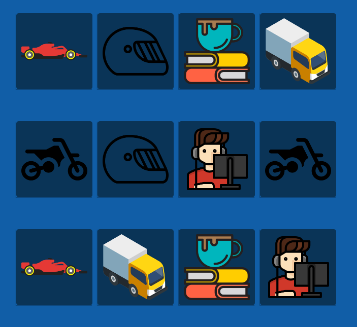

<h1 align="center">:books: Jogo da memória</h1>

## :memo: Descrição
O SafeChat foi criado com o objetivo de ser um sistema de conversas, um aplicativo de chat, para a troca de informações entre o suporte e o cliente que depende de um sistema. 
O chat foi desenvolvido para facilitar essa comunicação, tinha como objetivo ser feito em uma estrutura Serverless e utilizar os serviços de nuvem para sua execução.

## :wrench: Tecnologias utilizadas
* JavaScript;
* CSS3;
* HTML5;

## :rocket: O jogo
* Página inicial

* Tela inicial

* Cartas viradas

* Concluído

